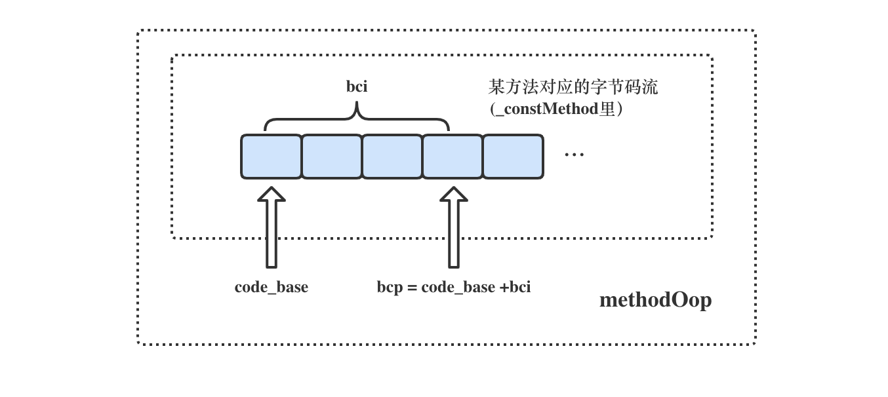

# 程序计数器

[TOC]

## 1、jvm规范

> Java虚拟机可以一次支持多个执行线程。每个Java虚拟机线程都有其自己的 `pc`（程序计数器）寄存器。在任何时候，每个Java虚拟机线程都在执行一个方法的代码，即该线程的当前方法。如果不是 **`native`**，则该`pc`寄存器包含当前正在执行的Java虚拟机指令的地址。如果线程当前正在执行的方法是`native`，则Java虚拟机的`pc` 寄存器值为`null`。

程序计数器（Program Counter Register）是一块较小的内存空间，它可以看做是当前线程所执行的字节码的行号指示器。在虚拟机的概念模型里（**仅是概念模型，各种虚拟机可能会通过一些更高效的方式去实现**），字节码解释器工作时就是通过改变这个计数器的值来选取下一条需要执行的字节码指令，分支、循环、跳转、异常处理、线程恢复等基础功能都需要依赖这个计数器来完成

由于Java虚拟机的多线程是通过线程轮流切换并分配处理器执行时间的方式来实现的，在任何一个确定的时刻，一个处理器（对于多核处理器来说是一个内核）都只会执行一条线程中的指令，因此，为了线程切换后能恢复到正确的执行位置，每个线程都需要有一个独立的程序计数器，各线程之间的计数器互不影响

JVM规范里还提到：对**native**方法而言，它的方法体并不是由Java字节码构成的，自然无法应用上述的“Java字节码地址”的概念。所以规范规定，如果当前执行的方法是native的，那么pc寄存器的值为**null**

下面是一个示例，用于简单理解一下pc寄存器，该图在栈的小节中会有详细的解释

## 2、hotspot实现

看完了虚拟机规范里的定义，需要注意一点是，上述的“pc寄存器”是在**抽象的JVM**层面上的概念，当执行Java方法时，这个抽象的“pc寄存器”存的是Java字节码的地址

而“pc寄存器”在具体实现中被映射成什么是没有规定的，Java程序在能感知PC寄存器状态的地方（例如抛异常要报告位置），JVM就必须保证这些位置能报告正确的PC寄存器的值，否则其实JVM里有没有时时更新“PC寄存器”其实Java程序是感知不到的，实际上也**不一定需要时刻维护着它的值**。

>在虚拟机的概念模型里（**仅是概念模型，各种虚拟机可能会通过一些更高效的方式去实现**），字节码解释器工作时就是通过改变这个计数器的值来选取下一条需要执行的字节码指令，分支、循环、跳转、异常处理、线程恢复等基础功能都需要依赖这个计数器来完成

另外在上述概念模型中，解释执行的过程中要依赖这个计数器来完成，但是也仅仅是在概念模型中，实际的hotspot实现在运行过程中并不依赖于它，详情可以看《解释执行》小节

在hotspot实现中，“pc寄存器”表现为两种形式，一种是相对该方法字节码开始处的偏移量，叫做bytecode index，简称bci；另一种是该Java字节码指令在内存里的地址，叫做bytecode pointer，简称bcp

