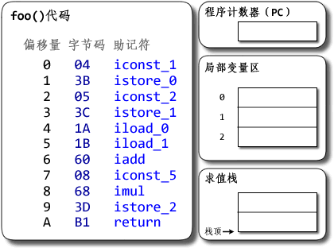
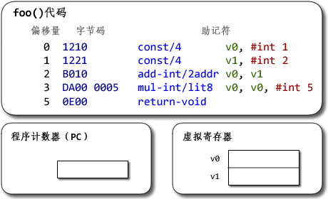

# JVM栈

[TOC]


## 1、jvm规范

在jvm规范中，将栈划分为虚拟机栈和本地方法栈，分别对应与java方法的调用和本地方法的调用

### 1.1 虚拟机栈

> 每个Java虚拟机线程都有一个私有Java虚拟机堆栈，与该线程同时被创建。Java虚拟机堆栈存储着栈帧。Java虚拟机栈类似于常规语言（例如C）的堆栈：它保存局部变量和部分结果，并在方法调用和返回中起作用。因为除了pop和push帧外，并不会直接操纵Java虚拟机堆栈，所以栈帧也可以从堆中分配。Java虚拟机栈的内存不必是连续的。
>
> 该规范允许Java虚拟机堆栈具有固定大小，或者根据计算要求动态扩展和收缩。如果Java虚拟机堆栈的大小固定，则在创建每个Java虚拟机栈时可以独立选择其大小。
>
> Java虚拟机实现可以为程序员或用户提供对Java虚拟机堆栈初始大小的控制，并且在动态扩展或收缩Java虚拟机堆栈的情况下，可以控制大小范围。

以上是jvm规范的描述，虚拟机栈的生命周期与线程相同，每个方法在执行的同时都会创建一个栈帧用于存储**局部变量表、操作数栈、动态链接、方法出口**等信息，每一个方法从调用到结束，都对应着一个栈帧在虚拟机栈中入栈到出栈的过程，下面对栈帧的结构进行介绍

#### 1.1.1 局部变量区域

> 每个栈帧都包含一个称为其**局部变量**的变量数组。栈帧的局部变量数组的长度在**编译成字节码时确定**
>
> 单个本地变量可以保存类型的值`boolean`，`byte`，`char`，`short`，`int`， `float`，`reference`，或`returnAddress`。类型为`long`或`double`可以通过两个局部变量保存
>
> 局部变量通过索引取值。第一个局部变量的索引为0，一般称为slot\_0。
>
> 类型为 `long`或`double`占用两个连续的局部变量。只能使用较小的索引来索引该值。例如，`double`存储在索引为_n_ 的局部变量数组中的类型值 实际上占据了索引为_n_和 _n_ +1 的局部变量；但是，无法从索引_n_ +1加载局部变量。它可以存储到_n_+1的位置。但是，这样做会使局部变量_n_的内容无效。
>
> Java虚拟机不需要 _n_为偶数。用直观的术语来说，类型的值`long`和 `double`不必在局部变量数组中进行64位对齐。
>
> Java虚拟机在方法调用时使用局部变量传递参数。在类方法调用时，所有参数都将从连续的局部变量（从局部变量0开始）传递。在调用实例方法时，局部变量0默认用于传递方法所属对象实例的引用（`java`中的`this`），随后其他参数将从局部变量_1_开始传递。

规范对局部变量的描述已经很清晰了，需要注意的是这里面定义的数据类型`reference`，`returnAddress`。

`reference`类型标示对一个对象实例的引用，规范中没有说明它的长度（长度与实际使用32还是64位虚拟机有关）和具体的结构，但是定义了有三种`reference` 类型：类类型，数组类型和接口类型，它们分别指向动态创建的类实例，数组和实现接口的类实例

`returnAddress`类型是为由Java虚拟机使用`JSR`，`RET`和`jsr_w`字节码服务的，曾被用于实现异常处理，但是在Java SE 7之后就已经被禁用了，就不管它了

#### 1.1.2 操作数栈

操作数栈是虚拟机栈帧中的一块区域，JVM的解释执行引擎被称为“**基于栈的执行引擎**“，其中的“栈“就是指**操作数栈**，与之相对的是“**基于寄存器的执行引擎**“，操比如python虚拟机等

##### 1.1.2.1 基于栈的指令集架构

以一个简单的例子来描述什么是基于栈的指令集：当虚拟机要完成类似`a = b + c`这样的操作时，它会怎么做呢，对于**基于栈的执行引擎（如jvm）**而言，它可能会将其转换成这种形式的字节码指令：

```text
iconst_1  
iconst_2  
iadd      
istore_0  
```

初看会感觉有些莫名其妙，尤其是`iadd`指令，光秃秃的，**源**和**目标**都没有，这种指令一般称为**零地址指令**，意味着源与目标都是隐含参数，其实现依赖于一种常见的数据结构，**栈**。

上面的`iconst_1、iconst_2`两条指令，分别向一个叫做“**操作数栈**”\(也被称为**求值栈**\)的地方压入局部变量1和局部变量2的值，然后`iadd`指令将栈顶的两个值相加后放回栈顶，istore\_0指令将栈顶的值放会局部变量0的位置

```text
iconst_1   # 将局部变量0压入栈
iconst_2   # 将局部变量1压入栈
iadd       # 将栈顶的两个值弹出，相加后再压入栈 
istore_0   # 将栈顶的值放回局部变量0
```

由于指令的源与目标都是隐含的，则一条零地址指令的长度可以很短，意味着可以用更少空间放下更多条指令。因此在空间紧缺的环境中，零地址指令是种可取的设计。但零地址指令的缺陷也很明显，要完成一件事情，一般需要比二地址或者三地址指令更多条指令。

##### 1.1.2.2 基于寄存器的指令集架构

同样是完成a=b+c这条语句，如果使用基于寄存器的指令集，就会大不一样，以x86为例，指令可能是这样的：

```text
X86 asm代码:
mov  eax, [1]  #将变量1放入寄存器eax  
add  eax, [2]  #将eax与变量2相加后放入寄存器eax
mov  [0], eax  #将eax的值放回变量0
```

基于寄存器的执行引擎并不需要“操作数栈“这样的结构，而是使用寄存器来存放计算过程中的中间变量

##### 1.1.2.3 基于栈与基于寄存器架构的VM的一组图解

要是拿两个分别实现了基于栈与基于寄存器架构、但没有直接联系的VM来对比，效果或许不会太好。现在恰巧有两者有紧密联系的例子——JVM与Dalvik VM。

JVM的字节码主要是零地址形式的，概念上说JVM是基于栈的架构。Google Android平台上的应用程序的主要开发语言是Java，通过其中的Dalvik VM来运行Java程序（2014年6月25日，谷歌直接删除了Dalvik，代替它的是ART）

为了能正确实现语义，Dalvik VM的许多设计都考虑到与JVM的兼容性；但它却采用了基于寄存器的架构，其字节码主要是二地址/三地址混合形式的，乍一看可能让人纳闷。考虑到Android有明确的目标：面向移动设备，特别是最初要对ARM提供良好的支持。ARM9有16个32位通用寄存器，Dalvik VM的架构也常用16个虚拟寄存器**，**这样Dalvik VM就不用太顾虑可移植性的问题，优先考虑在ARM9上以高效的方式实现，发挥基于寄存器架构的优势。

来看一段java源代码：

```cpp
public class Demo {  
    public static void foo() {  
        int a = 1;  
        int b = 2;  
        int c = (a + b) * 5;  
    }  
}  
```

通过javac编译，得到Demo.class。通过javap可以看到foo\(\)方法的字节码是：

```cpp
0:  iconst_1  
1:  istore_0  
2:  iconst_2  
3:  istore_1  
4:  iload_0  
5:  iload_1  
6:  iadd  
7:  iconst_5  
8:  imul  
9:  istore_2  
10: return
```

接着用Android SDK里platforms\android-1.6\tools目录中的dx工具将Demo.class转换为dex格式，得到Dalvik VM使用的字节码：

```cpp
0000: const/4       v0, #int 1 // #1  
0001: const/4       v1, #int 2 // #2  
0002: add-int/2addr v0, v1  
0003: mul-int/lit8  v0, v0, #int 5 // #05  
0005: return-void  
```

让我们看看两个版本在概念上是如何工作的，**首先看JVM**：



（图中数字均以十六进制表示。其中字节码的一列表示的是字节码指令的实际数值，后面跟着的助记符则是其对应的文字形式。标记为红色的值是相对上一条指令的执行状态有所更新的值。下同）

在上面的例子中，Demo.foo\(\)方法所需要的局部变量区大小为3个slot，需要的求值栈（操作数栈）大小为2个slot。Java源码的a、b、c分别被分配到局部变量区的slot 0、slot 1和slot 2。可以观察到Java字节码是如何指示JVM将数据**压入或弹出栈**，以及数据是如何在栈与局部变量区之前流动的；可以看到数据移动的次数特别多。动画里可能不太明显，iadd和imul指令都是要从求值栈弹出两个值运算，再把结果压回到栈上的；光这样一条指令就有3次概念上的数据移动了。

再看**Dalvik VM**：



说明：Dalvik字节码以16位为单元（或许叫“双字节码”更准确），上面代码中有5条指令，其中mul-int/lit8指令占2单元，其余每条都只占1单元，共6单元==12字节。 

与JVM相似，在Dalvik VM中每个线程都有自己的PC和调用栈，方法调用的活动记录以帧为单位保存在调用栈上。 与JVM不同的是，**Dalvik VM的栈帧中没有局部变量区与求值栈，取而代之的是一组虚拟寄存器**。每个方法被调用时都会得到自己的一组虚拟寄存器。常用v0-v15这16个，也有少数指令可以访问v0-v255范围内的256个虚拟寄存器。

与JVM相同的是，每个方法所需要的虚拟寄存器个数都能够在编译时确定，并且记录在.dex文件里；每个寄存器都是字长（32位），相邻的一对寄存器可用于保存64位数据。方法的参数按源码中从左到右的顺序保存在末尾的几个虚拟寄存器里。 与JVM版相比，**可以发现Dalvik版程序的指令数明显减少了**，**数据移动次数也明显减少了，用于保存临时结果的存储单元也减少了。**

再次提醒注意，**上面的描述是针对概念上的JVM与Dalvik VM，而不是针对它们的具体实现**。实现VM时可以采用许多优化技巧去减少性能损失，使得实际的运行方式与概念中的不完全相符，只要最终的运行结果满足原本概念上的VM所实现的语义就行。

##### 1.1.2.4 基于栈与基于寄存器架构的VM的对比

###### 1.1.2.4.1 实现的难易程度

由于指令中不必显式指定源与目标，生成指令（如字节码）的步骤会简单很多，不必考虑为临时变量分配空间的问题，求值过程中的临时数据存储都让操作数栈包办就行

当然这里并不是说虚拟机更容易实现，而是针对基于栈架构的指令集生成代码的编译器（javac命令）更容易实现

###### 1.1.2.4.2 可移植性

处理器的特性各个不同：典型的CISC处理器的通用寄存器数量很少，例如32位的x86就只有8个32位通用寄存器（如果不算EBP和ESP那就是6个，现在一般都算上）；典型的RISC处理器的各种寄存器数量多一些，例如ARM有16个32位通用寄存器，Sun的SPARC在一个寄存器窗口里则有24个通用寄存器

假如一个VM采用**基于寄存器的架构**（它接受的指令集大概就是二地址或者三地址形式的），为了高效执行，一般会希望能把源架构中的寄存器映射到实际机器上寄存器上。但是VM里有些很重要的辅助数据会经常被访问，例如一些VM会保存源指令序列的程序计数器（program counter，PC），为了效率，这些数据也得放在实际机器的寄存器里。

如果源架构中寄存器的数量跟实际机器的一样，或者前者比后者更多，那源架构的寄存器就没办法都**映射到实际机器的寄存器**上；这样VM实现起来比较麻烦，与能够全部映射相比效率也会大打折扣。像Dalvik VM的解释器实现，就是把虚拟寄存器全部映射到栈帧（内存）里的，这跟把局部变量区与操作数栈都映射到内存里的JVM解释器实现相比实际区别不太大。  

如果一个VM采用**基于栈的架构**，则无论在怎样的实际机器上，都很好实现——它的源架构里没有任何通用寄存器，所以实现VM时可以比较自由的分配实际机器的寄存器。于是这样的VM可移植性就比较高。作为优化，基于栈的VM可以用编译方式实现，“求值栈”实际上也可以由编译器映射到寄存器上，减轻数据移动的开销。

###### 1.1.2.4.3 性能

从性能上看，现在的实际处理器，大多都是基于寄存器的架构，从侧面反映出它比基于栈的架构更优秀。

 而对于VM来说，基于栈或者寄存器的vm，都可能是用实际机器的内存来模拟的，所以性能特性与实际硬件又有点不同。

一般认为基于寄存器的架构对VM来说也是更快的，原因是：虽然零地址指令更紧凑，但完成操作需要更多的load/store指令，也意味着更多的指令分派（instruction dispatch）次数与内存访问次数；访问内存是执行速度的一个重要瓶颈，二地址或三地址指令虽然每条指令占的空间较多，但总体来说可以用更少的指令完成操作，指令分派与内存访问次数都较少。

#### 1.1.3 运行环境区

### 1.2 本地方法栈

> Java虚拟机的实现可以使用传统的堆栈（俗称“ C栈”）来支持本地方法（用Java编程语言以外的语言编写的方法），解释程序的实现也可以使用诸如C之类的语言来解释Java虚拟机的指令集，以使用本地方法栈。无法加载本地方法并且自身不依赖于常规堆栈的Java虚拟机实现无需提供本地方法栈。如果提供，通常在创建每个线程时为每个线程分配本地方法栈。

以上是jvm规范的翻译节选，其他部分基本与java虚拟机栈一致，从中可以看出规范中有两类程序会用到本地方法栈：

* 运行java以外的编程语言编写的方法时，会用到本地方法栈
* jvm本身可能使用C之类的语言来实现的，所以也可能会用到本地方法栈

## 2、hotspot实现

在hotspot的实现中，**本地方法栈和虚拟机栈共用一个栈**（mixed-stack），区别仅在于本地方法和java方法产生的栈帧不同，此外，在linux中，混合栈是通过**轻量级线程的用户栈**来实现的，可以这么认为，**轻量级线程的用户栈中的栈帧就是一个个的java方法栈帧和native方法栈帧，**可以通过jstack命令来直观进行理解：

任意跑一个java代码，使用命令 `jstack -m {pid}`即可看到混合栈的信息：

```text
0x00007f2305c90da2	__pthread_cond_timedwait + 0x132
0x00007f2304dd18f3	_ZN2os5sleepEP6Threadlb + 0x283
0x00007f2304bcebda	JVM_Sleep + 0x3ba
0x00007f22f05a79b4	* java.lang.Thread.sleep(long) bci:0 (Interpreted frame)
0x00007f22f05982bd	* MainTest.main(java.lang.String[]) bci:49 line:40 (Interpreted frame)
0x00007f22f05907a7	<StubRoutines>
0x00007f2304b3bd16	_ZN9JavaCalls11call_helperEP9JavaValueP12methodHandleP17JavaCallArgumentsP6Thread + 0x1056
0x00007f2304b7d132	_ZL17jni_invoke_staticP7JNIEnv_P9JavaValueP8_jobject11JNICallTypeP10_jmethodIDP18JNI_ArgumentPusherP6Thread + 0x362
0x00007f2304b9999a	jni_CallStaticVoidMethod + 0x17a
0x00007f2305a76bdf	JavaMain + 0x81f
```

上图截取了一部分信息，地址右边的这一串就是混合栈中的栈帧，其中，以`*`开头的代表这是个**java栈帧**，其它的则是**本地方法栈帧。**

### 2.1 栈\(mixed-stack\)的创建

我们知道，在linux环境下，jvm的线程是通过**轻量级进程\(LWP\)**来实现的，而进程在创建LWP时需要给它分配栈空间（[前置知识](../pre-knowledge.md#21-qing-liang-ji-jin-cheng-lwp-de-di-zhi-kong-jian)），那么，对于Hotspot进程而言，它是如何分配栈空间的呢，追下源码：

```cpp
bool os::create_thread(Thread* thread, ThreadType thr_type, size_t stack_size){
     ...
     int ret = pthread_create(&tid, &attr, (void* (*)(void*)) java_start, thread);
     ...
}

```

在Os\_linux.cpp文件下，hotspot最终调用了pthread库的`phtread_create()`方法来创建LWP，代码中`&attr`会提供创建栈的参数，但实际上，hotspot并没有往这个参数中放分配好的栈地址，而**只是放了需要的栈大小**

再追一追pthread库的代码，发现如果调用`pthread_create()`方法时不指定地址，那么将默认调用mmap\(\)方法（ [前置知识](../pre-knowledge.md#3-1-1-mmap)）从进程中分配一块**内存映射空间**作为LWP的栈空间

至此，hotspot涉及到的栈相关的概念就都清楚了（进程栈、lwp栈、java栈，操作树栈）


参考书籍：《HOTSPOT实战》、[RednaxelaFX博客](https://www.iteye.com/blog/rednaxelafx-492667)


