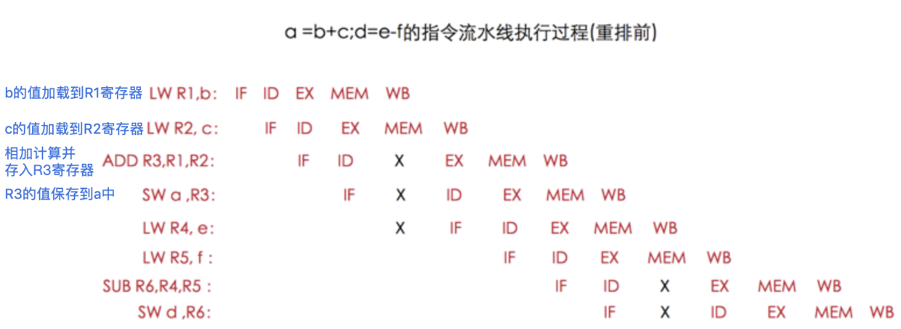
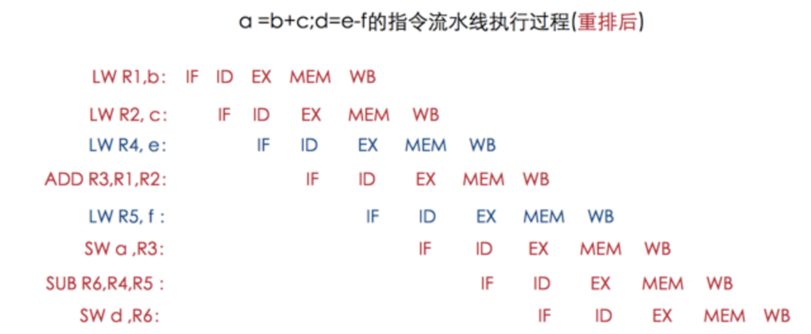

## 1.1 并发的概念

并发计算（concurrent computing）在维基百科上的释义是：一种程序计算的形式，在系统中，至少有两个以上的计算在同时运作，计算结果可能同时发生。

并发与并行的区别：

- 并行(parallel)：指在同一时刻，有多条指令在多个处理器上同时执行。所以无论从微观还是从宏观来看，二者都是一起执行的。

- 并发(concurrency)：指在同一时刻只能有一条指令执行，但多个进程指令被快速的轮换执行，使得在宏观上具有多个进程同时执行的效果，但在微观上并不是同时执行的。


并发计算的历史中有很多种实现形式，也不是Java语言特有的语言特性，但如今在Java中主要通过Java内存模型（JMM）来规范，通过多线程编程技术来实现，这些也是本篇文章主要的讨论范围。

我们知道并发编程很容易造成各种bug，比如共享变量读写错误、死锁等。但是究其原因，并发编程问题的源头在哪里？

从冯·诺依曼提出计算机的五大组成部分开始，后来进一步抽象到主要由CPU、内存和I/O组成运转的体系，一直存在的问题就是三者的速度差异巨大且一直存在，表现为 CPU 的速度 > 内存的速度 > I/O 设备的速度。为了充分开发利用计算机的潜能，体系结构、操作系统、编译程序等都做出了改变，但是硬件工程师和底层软件工程师的优化，给应用层软件工程师带来了并发同步问题。总结下来主要是三点：

- **本地内存导致的可见性问题**
- **线程切换执行导致的原子性问题**
- **编译器处理器优化指令重排带来的有序性问题**

接下来详细进行分析。

## 1.2 本地内存导致的可见性问题

一个线程对共享变量的修改，另外一个线程能够立刻看到，称为可见性。但是本地内存的出现使得可见性可能受到破坏。

本地内存（Local Memory）是JMM的一个抽象概念，线程私有，存储了该线程读写变量的副本，对应于主内存（Main Memory）的概念。但是这只是一个抽象概念，并不物理存在，它涵盖了缓存、写缓冲区、寄存器其他编译器和硬件优化。我们常常可以见到以下这张“JMM内存模型的抽象结构示意图”，较为贴切地说明了本地内存和主内存的关系。


为什么需要本地内存？既然本地内存不真实存在，我们就以CPU多级缓存为例解释。CPU的频率很快，但是主存的速度较慢无法匹配，导致CPU常处于空闲中浪费资源。所以多级缓存出现，是为了缓解CPU和内存之间速度的不匹配问题。背后的原理也是我们耳熟能详的：局部性原理。

>局部性原理表现为：时间局部性和空间局部性。
>时间局部性是指如果程序中的某条指令一旦执行，则不久之后该指令可能再次被执行；如果某数据被访问，则不久之后该数据可能再次被访问。
>空间局部性是指一旦程序访问了某个存储单元，则不久之后。其附近的存储单元也将被访问。

## 1.3 线程切换执行导致的原子性问题

一个或者多个操作在 CPU 执行的过程中不被中断的特性，称为原子性。但是CPU线程切换会导致原子性被破坏。

线程切换是操作系统对多任务执行所做的优化。起初针对进程切换时间片，后来出现了更细粒度的线程概念，将线程作为CPU调度的基本单位。但是高级语言中的一条指令常需要多条 CPU 指令完成，例如简单的 `count ++`，至少需要三条 CPU 指令：

1. 把变量 count 从内存加载到 CPU 的寄存器；
2. 在寄存器中执行 +1 操作；
3. 将结果写入内存（缓存机制导致可能写入的是 CPU 缓存而不是内存）。

但是CPU可能在任意一条CPU指令执行完成后切换时间片，造成高级语言的一条指令并不原子执行。

## 1.4 编译器处理器优化指令重排带来的有序性问题

在程序执行过程中，按照代码的顺序先后执行，称为有序性。但是各个级别为了优化所做的指令重排序会破坏程序的有序性。在处理并发问题时一条重要原则是：不要假设指令执行的顺序，你无法预知不同线程之间的指令会以何种顺序执行。原因是在执行程序时为了提高性能，编译器和处理器常常会对指令做重排序。

### 1.4.1 重排序的规则

如果两个操作访问同一个变量，且这两个操作中有一个为写操作，此时这两个操作之间就存在数据依赖性。编译器和处理器在重排序时，会遵守数据依赖性，编译器和处理器不会改变存在数据依赖关系的两个操作的执行顺序。as-if-serial 语义的意思指：不管怎么重排序（编译器和处理器为了提高并行度），（单线程）程序的执行结果不能被改变。编译器，runtime 和处理器都必须遵守 as-if-serial 语义。

注意，这里所说的数据依赖性**仅针对单个处理器中执行的指令序列和单个线程中执行的操作，不同处理器之间和不同线程之间的数据依赖性不被编译器和处理器考虑**，这就是我们并发编程要考虑的问题。

### 1.4.2 重排序的分类

重排序分三种类型，分别介绍

#### 1.4.2.1 编译器优化的重排序。

编译器在不改变单线程程序语义的前提下，可以重新安排语句的执行顺序。

抽象举例：
假设第一条指令计算一个值赋给变量A并存放在寄存器中，第二条指令与A无关但需要占用寄存器（假设它将占用A所在的那个寄存器），第三条指令使用A的值且与第二条指令无关。那么如果按照顺序一致性模型，A在第一条指令执行过后被放入寄存器，在第二条指令执行时A不再存在，第三条指令执行时A重新被读入寄存器，而这个过程中，A的值没有发生变化。通常编译器都会交换第二和第三条指令的位置，这样第一条指令结束时A存在于寄存器中，接下来可以直接从寄存器中读取A的值，降低了重复读取的开销。

#### 1.4.2.2. 指令级并行的重排序。

现代处理器采用了流水线技术来将多条指令重叠执行。可以通过指令重排使得具有相似功能单元的指令接连执行来减少流水线中断的情况。

先了解一下指令重排的概念，处理器指令重排是对CPU的性能优化，从指令的执行角度来说一条指令可以分为多个步骤完成，如下

```
取指 IF
译码和取寄存器操作数 ID
执行或者有效地址计算 EX
存储器访问 MEM
写回 WB
```

CPU在工作时，需要将上述指令分为多个步骤依次执行(注意硬件不同有可能不一样),由于每一个步会使用到不同的硬件操作，为了提高硬件利用率，CPU指令是按流水线技术来执行的。但不幸的是一旦出现流水中断，所有硬件设备将会进入一轮停顿期，当再次弥补中断点可能需要几个周期，这样性能损失也会很大。因此我们需要尽量阻止指令中断的情况，指令重排就是其中一种优化中断的手段，我们通过一个例子来阐明指令重排是如何阻止流水线技术中断的。

举例：
下面代码执行过程中的优化

```
a = b + c ;
d = e + f ;
```



在某些指令上存在X的标志，X代表中断的含义，也就是只要有X的地方就会导致指令流水线技术停顿，同时也会影响后续指令的执行，可能需要经过1个或几个指令周期才可能恢复正常。这是因为部分数据还没准备好，如执行ADD指令时，需要使用到前面指令的数据R1，R2，而此时R2的MEM操作没有完成，即未拷贝到存储器中，这样加法计算就无法进行，必须等到MEM操作完成后才能执行。

停顿会造成CPU性能下降，因此我们应该想办法消除这些停顿，这时就需要使用到指令重排了，既然ADD指令需要等待，那我们就利用等待的时间做些别的事情，如把`LW R4,e` 和 `LW R5,f `移动到前面执行，毕竟`LW R4,e` 和 `LW R5,f`执行并没有数据依赖关系，对他们有数据依赖关系的`SUB R6,R5,R4`指令在 R4, R5 加载完成后才执行的，没有影响，过程如下：



对于单线程而已指令重排几乎不会带来任何影响，重排的前提是保证串行语义执行的一致性。但对于多线程环境，指令重排就可能导致严重的程序顺序执行问题。

#### 1.4.2.3. 内存系统的重排序。

现代的处理器使用写缓冲区来临时保存向内存写入的数据，通过以批处理的方式刷新写缓冲区，以及合并写缓冲区中对同一内存地址的多次写，可以减少对内存总线的占用。但每个处理器上的写缓冲区，仅仅对它所在的处理器可见。这个特性会对内存操作的执行顺序产生重要的影响：**处理器对内存的读 / 写操作的执行顺序，不一定与内存实际发生的读 / 写操作顺序一致**。

举例：

| 处理器A       | 处理器B       |
| ------------- | ------------- |
| a = 1;  // A1 | b = 2;  // B1 |
| x = b;  // A2 | y = a;  // B2 |

初始状态：a = b = 0，如果严格按照程序顺序执行，不可能出现 x 和 y 同时为 0 的情况（ a 和 b 总有一个会先被赋值），但是实际执行完毕后可能得到 x = y = 0 的结果。执行过程如下图表示：


从内存操作实际发生的顺序来看，直到处理器 A 执行 A3 来刷新自己的写缓存区，写操作 A1 才算真正执行了。虽然处理器 A 执行内存操作的顺序为：A1->A2，但内存操作实际发生的顺序却是：A2->A1。此时，处理器 A 的内存操作顺序被重排序了。

这里的关键是，由于写缓冲区仅对自己的处理器可见，它会导致处理器执行内存操作的顺序可能会与内存实际的操作执行顺序不一致。由于现代的处理器都会使用写缓冲区，因此现代的处理器都会允许对写 - 读操做重排序。

### 1.4.3 解决重排序问题的常用思路

上述重排序的分类中，编译器优化重排序属于编译器重排序，指令级并行重排序和内存系统重排序属于处理器重排序。对于编译器，JMM 会禁止特定类型的编译器重排序（不是所有的编译器重排序都要禁止）。对于处理器重排序，JMM 会要求 java 编译器在生成指令序列时，插入特定类型的内存屏障（memory barriers）指令，通过内存屏障指令来禁止特定类型的处理器重排序（不是所有的处理器重排序都要禁止）。

禁止编译器重排序很好理解，下面主要解释内存屏障。

JMM 把内存屏障指令分为下列四类：

| 屏障类型            | 指令示例                   | 说明                                                         |
| ------------------- | -------------------------- | ------------------------------------------------------------ |
| LoadLoad Barriers   | Load1; LoadLoad; Load2     | 确保 Load1 数据的装载，之前于 Load2 及所有后续装载指令的装载。 |
| StoreStore Barriers | Store1; StoreStore; Store2 | 确保 Store1 数据对其他处理器可见（刷新到内存），之前于 Store2 及所有后续存储指令的存储。 |
| LoadStore Barriers  | Load1; LoadStore; Store2   | 确保 Load1 数据装载，之前于 Store2 及所有后续的存储指令刷新到内存。 |
| StoreLoad Barriers  | Store1; StoreLoad; Load2   | 确保 Store1 数据对其他处理器变得可见（指刷新到内存），之前于 Load2 及所有后续装载指令的装载。StoreLoad Barriers 会使该屏障之前的所有内存访问指令（存储和装载指令）完成之后，才执行该屏障之后的内存访问指令。 |

StoreLoad Barriers 是一个“全能型”的屏障，它同时具有其他三个屏障的效果。现代的多处理器大都支持该屏障（其他类型的屏障不一定被所有处理器支持，因为很有可能该处理器本身就不允许某些重排序操作）。执行该屏障开销会很昂贵，因为当前处理器通常要把写缓冲区中的数据全部刷新到内存中（buffer fully flush）。